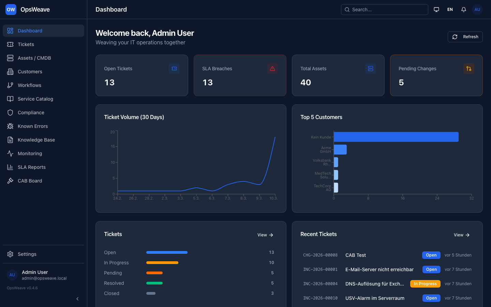
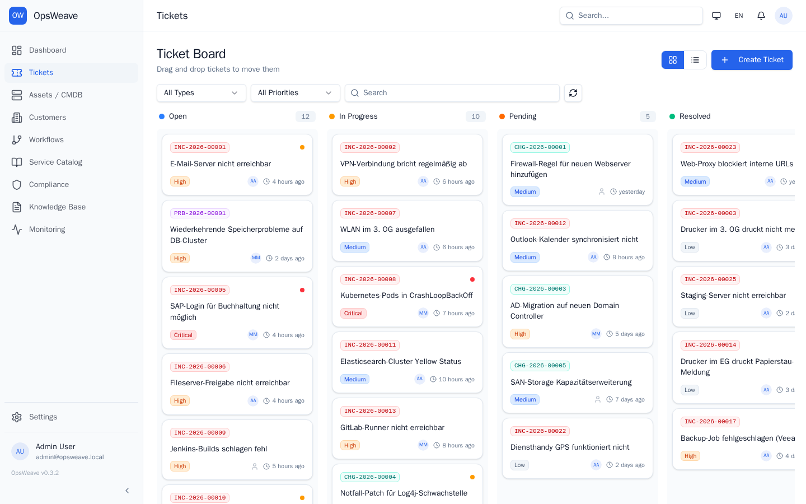
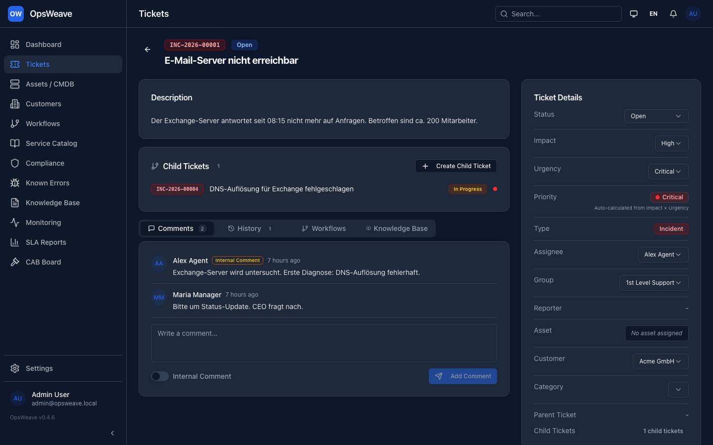
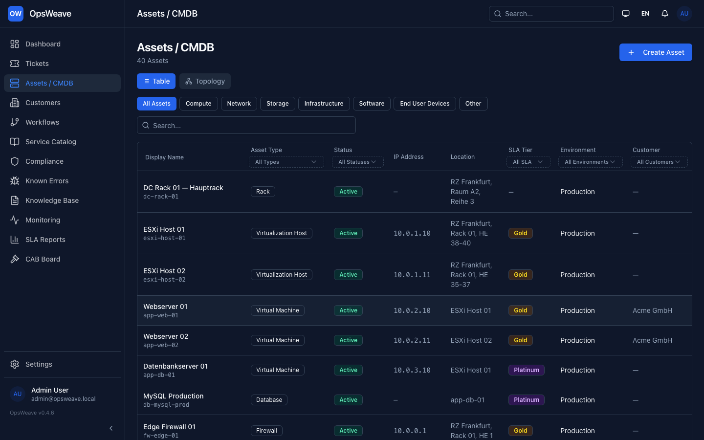
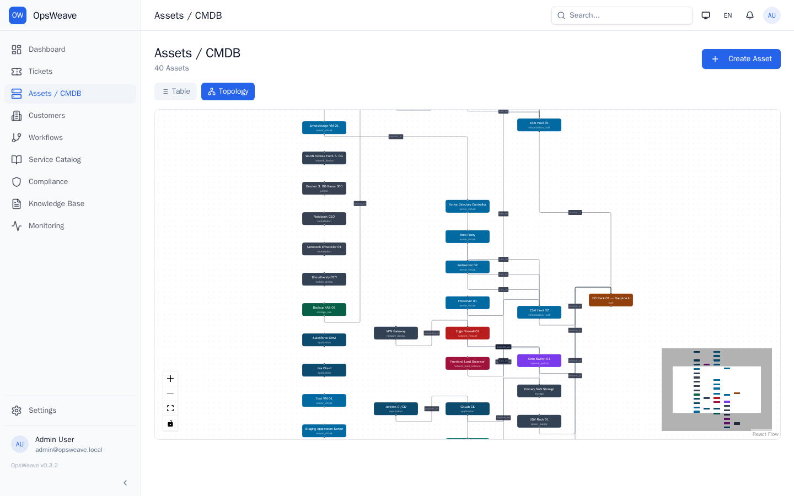
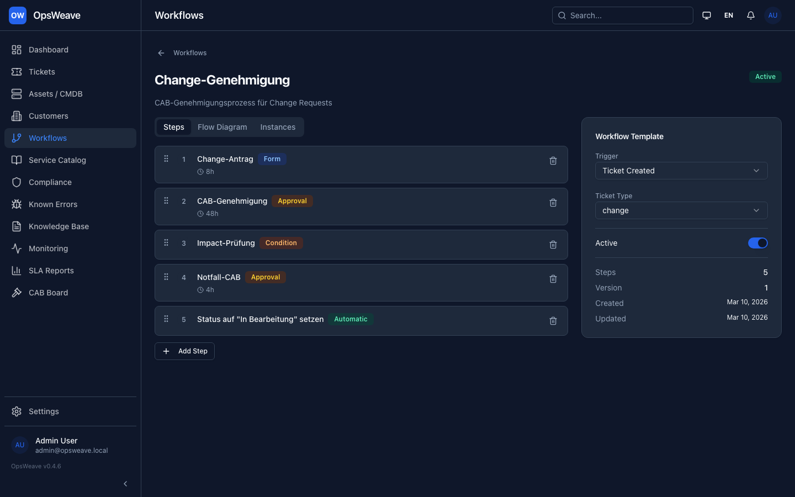

<p align="center">
  
</p>

<h1 align="center">OpsWeave</h1>

<p align="center">
  <strong>Weaving your IT operations together — asset-zentriert, workflow-gesteuert.</strong>
</p>

<p align="center">
  <a href="#quick-start">Quick Start</a> •
  <a href="#features">Features</a> •
  <a href="#dokumentation">Docs</a> •
  <a href="#editionen">Editionen</a> •
  <a href="#mitmachen">Mitmachen</a>
</p>

<p align="center">
  
  
  
  
</p>

---

## Was ist OpsWeave?

OpsWeave ist ein modulares, asset-zentriertes IT Service Management System. Es kombiniert
ITIL-konforme Prozesse (Incident, Problem, Change) mit einer leistungsfähigen CMDB,
einem Service-Katalog, Compliance-Mapping und Workflow-Automatisierung — alles in
einer einzigen, einfach zu deployyenden Anwendung.

**Alles dreht sich um das Asset.** Jedes Ticket, jede SLA, jeder Servicevertrag und
jede Compliance-Anforderung verweist auf Assets in der CMDB. Dadurch hast du sofort
vollständigen Kontext — wenn ein Incident eingeht, siehst du direkt die betroffene
Infrastruktur, geltende SLAs, regulatorische Anforderungen und Servicevereinbarungen.

<p align="center">
  
</p>

### Kanban-Board

<p align="center">
  
</p>

### Ticket-Detail

<p align="center">
  
</p>

### CMDB & Asset-Topologie

<p align="center">
  
</p>

<p align="center">
  
</p>

### Workflow-Designer

<p align="center">
  
</p>

## Quick Start

**Single Container — in 30 Sekunden betriebsbereit:**

```bash
docker run -d \
  -p 8080:8080 \
  -v opsweave-data:/data \
  --name opsweave \
  ghcr.io/slemens/opsweave:latest
```

Öffne [http://localhost:8080](http://localhost:8080) und logge dich mit
`admin@opsweave.local` / `changeme` ein.

**Production-Deployment mit PostgreSQL:**

```bash
git clone https://github.com/slemens/opsweave.git
cd opsweave
cp .env.example .env    # Anpassen
docker compose up -d
```

## Features

### 🎫 Ticket Management
- Incident-, Problem- und Change-Prozesse (ITIL-konform)
- Kanban-Board mit Drill-Down-Ansichten
- Drag & Drop zwischen Bearbeiter-Gruppen
- Vollständiges Audit-Trail und Kommentar-System
- SLA-Tracking mit automatischer Breach-Erkennung

### 🗄️ CMDB (Configuration Management Database)
- Asset-zentriertes Datenmodell mit typisierten Beziehungen
- Directed Acyclic Graph (DAG) — Assets können mehrere Parent-Nodes haben
- Typisierte Kanten: `runs_on`, `depends_on`, `connects_to`, `hosted_by` etc.
- **SLA-Vererbung** — erkennt automatisch SLA-Konflikte im Abhängigkeitsgraph
- Interaktive Graph-Visualisierung

### ⚙️ Workflow Engine
- Visueller Workflow-Designer (Drag & Drop)
- Step-Typen: Formulare, Routing, Genehmigungen, Bedingungen, Automatisierungen
- Automatische Instanziierung basierend auf Ticket-Typ
- Timeout-basierte Eskalation

### 📋 Service Katalog (3-Tier)
- **Leistungsbeschreibungen** — atomare Bausteine (Was du tust — und was nicht)
- **Horizontaler Katalog** — Standard-Service-Bundles
- **Vertikale Kataloge** — branchen-spezifische Overrides (Enterprise)
- Direkte Verknüpfung mit CMDB-Assets

### ✅ Compliance & Regulatorik-Mapping
- Framework-Verwaltung (ISO 27001, DSGVO, BSI IT-Grundschutz, ...)
- Anforderungen Services zuordnen
- Compliance-Matrix mit Gap-Analyse
- Assets mit Regulatorik-Flags versehen

### 📚 Wissensdatenbank
- Markdown-Artikel mit Ticket-Verknüpfung
- Interne und öffentliche Sichtbarkeit
- Volltextsuche, Kategorien, Tags
- Direkte Artikel-Ansicht im Kundenportal

### 🏢 Kundenportal
- Self-Service Portal für Endkunden
- Eigene Authentifizierung (getrennt von Agenten-Accounts)
- Ticket-Ansicht, Kommentare, neue Tickets erstellen
- Zugriff auf öffentliche KB-Artikel

### 🌐 Für Teams gebaut
- **Zweisprachig:** Deutsch (Standard) und Englisch, pro User umschaltbar
- **REST API:** Jede Funktion ist über die API zugänglich
- **OIDC-Authentifizierung:** Azure AD, Keycloak, Okta (Enterprise)
- **Rollenbasierter Zugang:** Admin, Manager, Agent, Viewer

## Editionen

| | Community | Enterprise |
|---|:---:|:---:|
| **Preis** | Kostenlos | Auf Anfrage |
| **Assets** | 50 | Unbegrenzt |
| **Benutzer** | 5 | Unbegrenzt |
| **Tickets** | ∞ | ∞ |
| **CMDB** | ✅ Vollständig | ✅ Vollständig |
| **Workflow-Templates** | 3 | ∞ |
| **Service Katalog** | Basis | Vollständig (Vertikale Kataloge) |
| **Compliance-Frameworks** | 1 | ∞ |
| **Authentifizierung** | Lokal | + OIDC/SAML |
| **Monitoring-Quellen** | 1 | ∞ |
| **API** | ✅ Vollständig | ✅ Vollständig |

Die Community Edition ist vollständig funktional — keine künstlichen Feature-Sperren.
Enterprise-Features ergänzen Skalierung und Enterprise-Authentifizierung.

## Tech-Stack

- **Frontend:** React 19, TypeScript, Tailwind v4, shadcn/ui, React Flow
- **Backend:** Node.js, Express 5, TypeScript
- **Datenbank:** PostgreSQL (Produktion) oder SQLite (Single-Container)
- **ORM:** Drizzle ORM (unterstützt beide Datenbanken)
- **Auth:** Lokale Accounts + OIDC (Enterprise)
- **Queue:** BullMQ + Redis (Produktion) oder better-queue (Single-Container)
- **i18n:** react-i18next (Frontend) + i18next (Backend)

## Dokumentation

Vollständige Dokumentation: **[https://slemens.github.io/opsweave](https://slemens.github.io/opsweave)**

- [Guide: Was ist OpsWeave?](docs/guide/index.md)
- [Installation](docs/guide/installation.md)
- [Quick Start](docs/guide/quickstart.md)
- [Lizenzierung](docs/guide/licensing.md)
- [REST API](docs/api/index.md)

## API

```bash
# Alle Incidents auflisten
curl -H "Authorization: Bearer $TOKEN" \
  http://localhost:8080/api/v1/tickets?ticket_type=incident

# Asset erstellen
curl -X POST -H "Content-Type: application/json" \
  -H "Authorization: Bearer $TOKEN" \
  -d '{"name":"web-server-01","asset_type":"server_virtual","sla_tier":"gold"}' \
  http://localhost:8080/api/v1/assets

# SLA-Vererbungskette prüfen
curl -H "Authorization: Bearer $TOKEN" \
  http://localhost:8080/api/v1/assets/{id}/sla-chain
```

## Mitmachen

Beiträge sind willkommen! Bitte lese die [Contributing-Richtlinien](CONTRIBUTING.md)
bevor du einen Pull Request einreichst.

- **Issues:** Bug-Reports und Feature-Requests via GitHub Issues
- **PRs:** Fork → Branch → PR (Englisch, Conventional Commits)
- **Diskussionen:** GitHub Discussions für Fragen und Ideen

## Lizenz

OpsWeave ist lizenziert unter der [GNU Affero General Public License v3.0](LICENSE).

---

<p align="center">
  Mit ❤️ für die ITSM-Community gebaut
</p>
