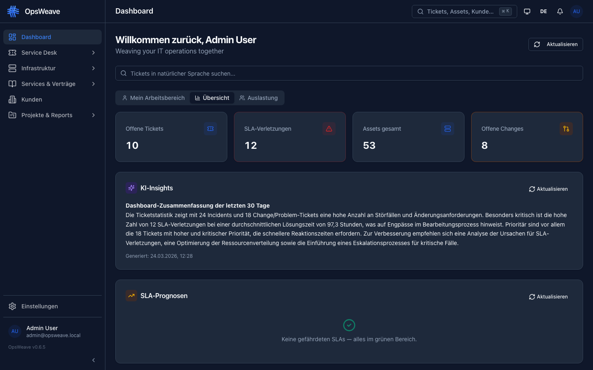
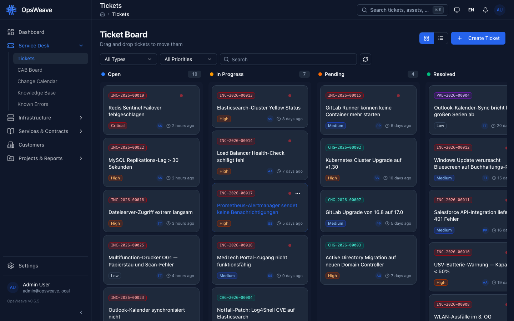
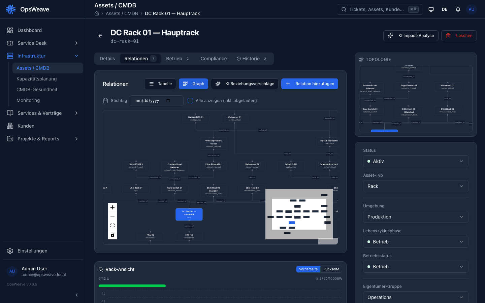
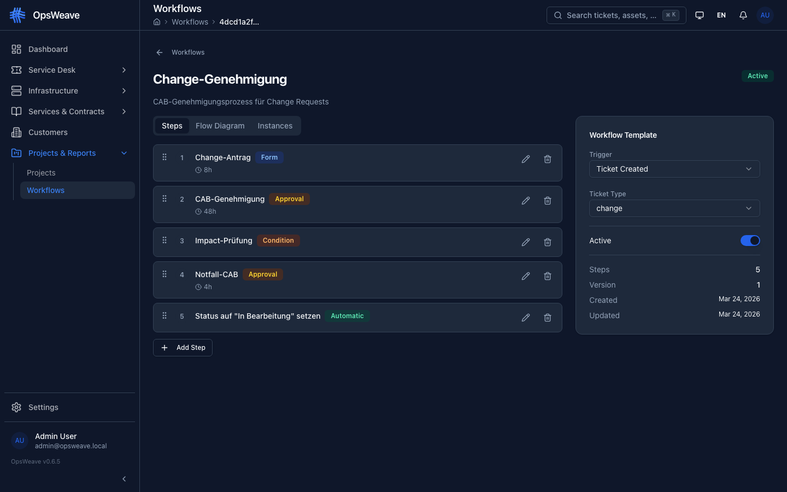
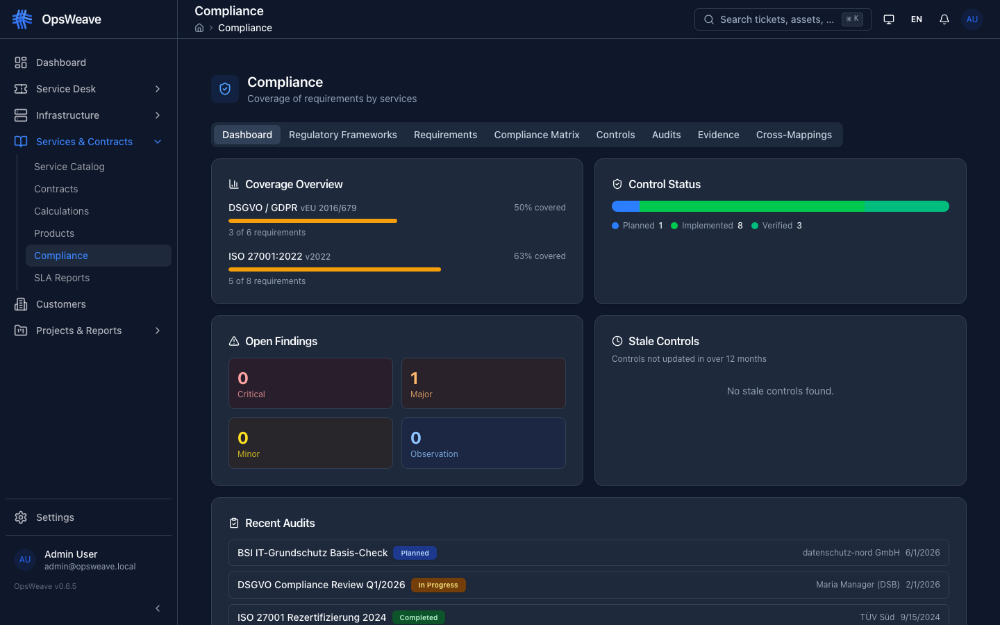

<div align="center">
  

  <br /><br />

  <h1>OpsWeave</h1>

  <p><strong>IT Service Management that takes your CMDB seriously.</strong></p>
  <p>OpsWeave links tickets, SLAs and compliance to your assets — find the right lever the moment something breaks.</p>

  <p>
    <a href="https://github.com/users/slemens/packages/container/package/opsweave"></a>
    <a href="https://demo.opsweave.de"></a>
    <a href="https://docs.opsweave.de"></a>
  </p>

  <p>
    <a href="https://demo.opsweave.de"><strong>Live Demo</strong></a> ·
    <a href="https://docs.opsweave.de"><strong>Documentation</strong></a> ·
    <a href="https://github.com/slemens/opsweave/issues"><strong>Issues</strong></a> ·
    <a href="https://opsweave.de/pricing.html"><strong>Pricing</strong></a>
  </p>
</div>

---

## Why teams pick OpsWeave

- **CMDB-first with DAG** — asset relations, dependencies, and impact paths visible
- **Full ITIL suite** — Incident, Problem, Change, Service Request with SLA engine and auto-escalation
- **1,369 compliance controls bundled** — ISO 27001, BSI C5, NIS2, GDPR out of the box
- **Multi-tenant by design** — strict row-level isolation, MSP-ready
- **Self-hosted in the EU** — your data on your infrastructure, no US-cloud risk

## Quick start

```bash
git clone https://github.com/slemens/opsweave.git
cd opsweave/examples
cp .env.example .env
docker compose up -d
```

Open http://localhost:8080 — initial credentials: `admin@opsweave.local` / `changeme`.

For production setups (PostgreSQL + Redis multi-container) see [docs.opsweave.de](https://docs.opsweave.de).

## A look inside

<table>
  <tr>
    <td width="50%">
      <a href="assets/screenshots/ticket-board.png"></a>
      <p align="center"><sub><b>ITIL Ticket Board</b> — Kanban with drag-and-drop, filters, SLA status</sub></p>
    </td>
    <td width="50%">
      <a href="assets/screenshots/cmdb-topology.png"></a>
      <p align="center"><sub><b>CMDB Topology</b> — DAG visualization of asset relations and impact paths</sub></p>
    </td>
  </tr>
  <tr>
    <td width="50%">
      <a href="assets/screenshots/workflow-detail.png"></a>
      <p align="center"><sub><b>Workflow Designer</b> — Visual editor with CAB voting for change processes</sub></p>
    </td>
    <td width="50%">
      <a href="assets/screenshots/compliance.png"></a>
      <p align="center"><sub><b>Compliance Matrix</b> — ISO 27001, BSI C5, NIS2 framework mapping</sub></p>
    </td>
  </tr>
</table>

→ Live walkthrough at [demo.opsweave.de](https://demo.opsweave.de).

## Pricing

| Tier | Assets | Users | Workflows | Auth | Price |
|---|---:|---:|---:|---|---:|
| **Starter** | 50 | 5 | 3 | Local | Free |
| **Team** | 250 | 15 | 10 | Local | €49/mo |
| **Business** | 1,000 | 50 | ∞ | + OIDC | €149/mo |
| **Enterprise** | ∞ | ∞ | ∞ | + SAML/OIDC | Contact |

→ Full details on [opsweave.de/pricing.html](https://opsweave.de/pricing.html)

## Source code

Source code is not distributed with the binary. Audit-grade source code review is available on request under a separate Non-Disclosure Agreement — contact [sebastian@opsweave.de](mailto:sebastian@opsweave.de).

## Telemetry

OpsWeave transmits anonymous operational telemetry (instance UUID, version, DB type, aggregate counts of assets, users, tickets). No personal data, tenant names, or business content is collected. Disable with `OPSWEAVE_TELEMETRY=false`.

## License

Copyright © 2026 Sebastian Lemens · see [LICENSE](LICENSE) · commercial license required for tiers above Starter.
